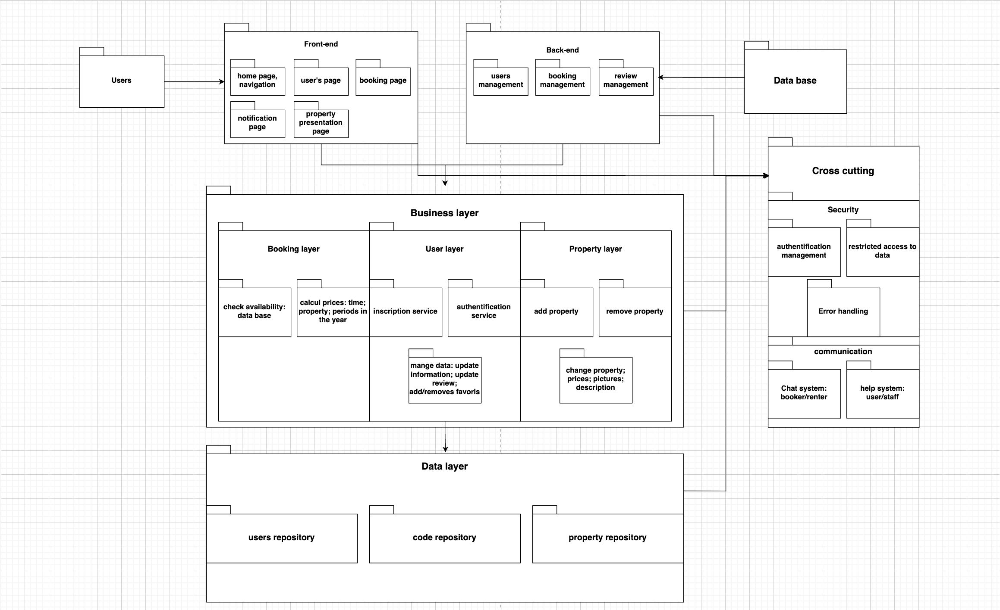

# HBnB Project 

## Table of Contents
1. [Project Overview](#project-overview)
2. [Project Tasks](#project-tasks)
3. [Technical Documentation](#technical-documentation)
   - [Task 0: Package Diagram](#task-0-package-diagram)
   - [Task 1: Class Diagram](#task-1-class-diagram)
   - [Task 2: Sequence Diagrams](#task-2-sequence-diagrams)
   - [Task 3: Technical Documentation](#task-3-technical-documentation)
4. [Business Rules and Requirements](#business-rules-and-requirements)
5. [Architecture](#architecture)
6. [Installation and Setup](#installation-and-setup)
7. [Contributing](#contributing)

## Project Overview

HBnB is an educational project that aims to create a simplified version of AirBnB. This project implements a complete web application integrating database storage, a back-end API, and front-end interface.

## Project Tasks

### Task 0: Package Diagram

Current implementation includes:

#### Front-end Layer
- Home page and navigation
- User's page
- Booking page
- Property presentation page
- Notification page

#### Back-end Layer
- Users management
- Booking management
- Review management

#### Business Layer
1. **Booking Layer**
   - Check availability: data base
   - Calculate prices: time, property, periods in the year
   - Inscription service

2. **User Layer**
   - Authentication service
   - Manage data: update information, update review
   - Add/removes favorites

3. **Property Layer**
   - Add property
   - Remove property
   - Change property: prices, pictures, description

#### Data Layer
- Users repository
- Code repository
- Property repository

#### Cross-cutting Concerns
- Security
  - Authentication management
  - Restricted access to data
- Error Handling
- Communication
  - Chat system between booker/renter
  - Help system for user/staff

### Task 1: Class Diagram
[À venir - Diagramme de classe détaillé de la couche Business Logic]

### Task 2: Sequence Diagrams
[À venir - Diagrammes de séquence pour les appels API]
- User Registration Flow
- Place Creation Flow
- Review Submission Flow
- Place Listing Flow

### Task 3: Technical Documentation
[À venir - Documentation technique complète]

## Business Rules and Requirements

### Entities

#### User Entity
- First name, last name, email, password
- Administrator status (boolean)
- CRUD operations

#### Place Entity
- Title, description, price, latitude, longitude
- Owner association
- Amenities list
- CRUD operations

#### Review Entity
- Rating and comment
- Place and user association
- CRUD operations

#### Amenity Entity
- Name and description
- CRUD operations

### Common Requirements
- UUID4 for all objects
- Creation and update timestamps for all entities

## Architecture

The application follows a layered architecture divided into:
- Presentation Layer (Services & API)
- Business Logic Layer (Models)
- Persistence Layer (Database)

## Installation and Setup
[À venir - Instructions d'installation]

## Contributing

This is an educational project. While it's not open for public contributions, feedback and suggestions are welcome.

## License

This project is part of the curriculum at Holberton School. All rights reserved.

## Authors

- Stan QUEUNIEZ
- Killian LEMOINE

## Acknowledgments

- This project is inspired by AirBnB
- Special thanks to our school and mentors