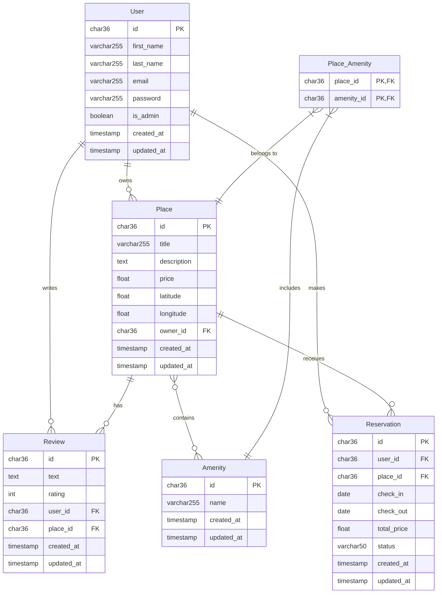

```mermaid
erDiagram
    User {
        char36 id PK
        varchar255 first_name
        varchar255 last_name
        varchar255 email
        varchar255 password
        boolean is_admin
        timestamp created_at
        timestamp updated_at
    }

    Place {
        char36 id PK
        varchar255 title
        text description
        float price
        float latitude
        float longitude
        char36 owner_id FK
        timestamp created_at
        timestamp updated_at
    }

    Review {
        char36 id PK
        text text
        int rating
        char36 user_id FK
        char36 place_id FK
        timestamp created_at
        timestamp updated_at
    }

    Amenity {
        char36 id PK
        varchar255 name
        timestamp created_at
        timestamp updated_at
    }

    Place_Amenity {
        char36 place_id PK,FK
        char36 amenity_id PK,FK
    }

    Reservation {
        char36 id PK
        char36 user_id FK
        char36 place_id FK
        date check_in
        date check_out
        float total_price
        varchar50 status
        timestamp created_at
        timestamp updated_at
    }

    User ||--o{ Place : "owns"
    User ||--o{ Review : "writes"
    Place ||--o{ Review : "has"
    Place }o--o{ Amenity : "contains"
    Place_Amenity }|--|| Place : "belongs to"
    Place_Amenity }|--|| Amenity : "includes"
    User ||--o{ Reservation : "makes"
    Place ||--o{ Reservation : "receives"
```